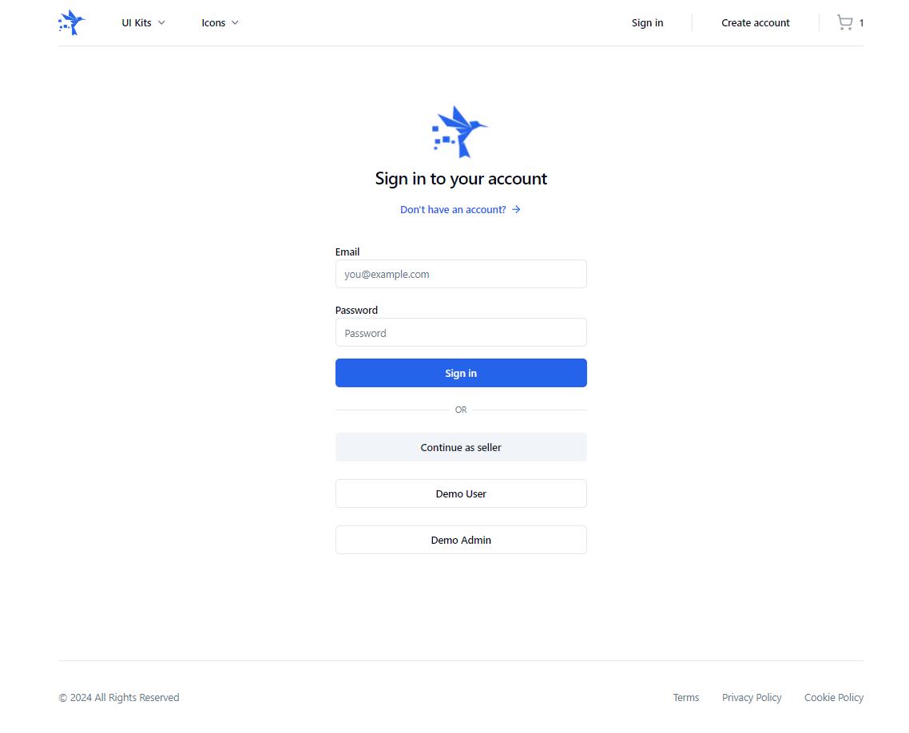

# Digital - Your Marketplace for High-Quality Digital Assets

**Digital** is a modern marketplace where users can purchase and sell high-quality digital assets. This project is designed with a clean and responsive UI, providing an intuitive experience across large, medium, and small screens.

## 🚀 Features

- **Landing Page & Product Pages:** Custom-designed pages that are visually appealing and user-friendly.
- **Full Admin Dashboard:** A comprehensive dashboard for admins to manage the marketplace.
- **User-Driven Marketplace:** Users can register, authenticate, and manage their own digital products for sale.
- **Locally Persisted Shopping Cart:** Users can add products to their cart and continue shopping without losing their items.
- **Authentication with Payload:** Secure user authentication and authorization using Payload.
- **Modern UI with Shadcn-ui:** A clean, modern interface created with Shadcn-ui for an enjoyable user experience.
- **Emails:** Attractive email designs for account registration and purchase confirmations.
- **Product Verification:** Admins can verify products to ensure they meet the marketplace's quality standards.

## 🛠️ Technologies Used

- **Next.js**
- **TypeScript**
- **tRPC**
- **Payload (Headless CMS)**
- **Shadcn-ui**

## 🖼️ Screenshots

Below are some screenshots of the Digital marketplace:

### Landing Page, Mobile Navigation, and Mobile View

### Sign In, Email Verification, and Cart

### Checkout, Order Completion, and Order Email

### Product Details, Payment, and Admin Dashboard

## 📝 License

This project is licensed under the MIT License. See the `LICENSE` file for more details.
